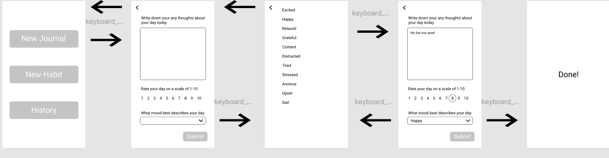
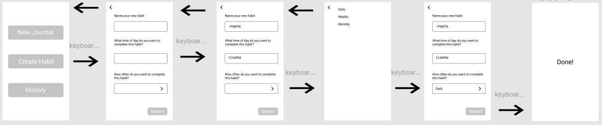
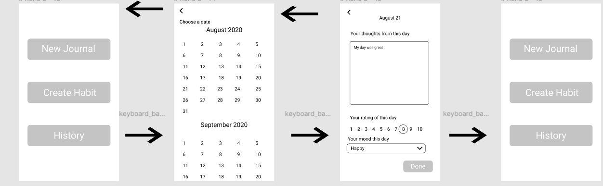

# Assignment-06
## Overview
### Purpose
The purpose of this low fidelity prototype is to test how specific users will interact with the features and flow of the app as expected. The most important part is to gain feedback on whether or not the flow of each task is intuitive and clear and thus gain feedback on which improvements should be made. In addition, this prototype will draw on my user research which revealed the lack of knowledge on daily journals and the potential benefits of it. My user research also helped clarify what exactly users want to record and prioritize when it comes to creating daily journals. 
### Personas
The first persona is a 44 year old working mom named Elizabeth Montgomery. She focuses on spending time with her children and keeping them mentally and physically active despite her busy schedule. She prioritizes simple technology that also is fun to use and has clear benefits for both her and her children. The second persona is 21 year old UCLA student Marcus Wang. His focus is boosting productivity and having detailed records of each of his days. His goals are to improve his schoolwork and productivity through proper mental care.
### Features
The three features being tested today are: 
1. Creating a basic daily journal 
2. Creating a new habit to be tracked
3. Viewing records of past journals
## Feature 1

Video of user testing: https://drive.google.com/file/d/1fMkqS15y3Kg0p-3h5XV5AYeUArHfPVoy/view?usp=sharing
Notes from user testing: The main issue the user ran into here was the drop menu taking users to a whole different page rather than adding an overlay that is usually expected of a drop menu. There was also a question of what would happen after the final Done! screen and whether or not there was a way to return to the home screen. 
## Feature 2

Video of user testing: https://drive.google.com/file/d/16JCbWZdKO6BAfxISaEOme4bOUM6YICzz/view?usp=sharing
Notes from user testing: The main issue the user ran into here was the open-endedness of each prompt. For example, the ability to create any new habit was confusing, or the strict options of only daily, weekly, or monthly. 
## Feature 3

Video of user testing: https://drive.google.com/file/d/1oDUpcU9ynrP875hKHMPnUfzbvE6_qmuJ/view?usp=sharing
Notes from user testing: The only issue the user ran into in this feature was that since this page looked like the daily journal page, many of the buttons of the page look clickable. In reality, nothing on the page is clickable or causes any action except for the Done button. 
